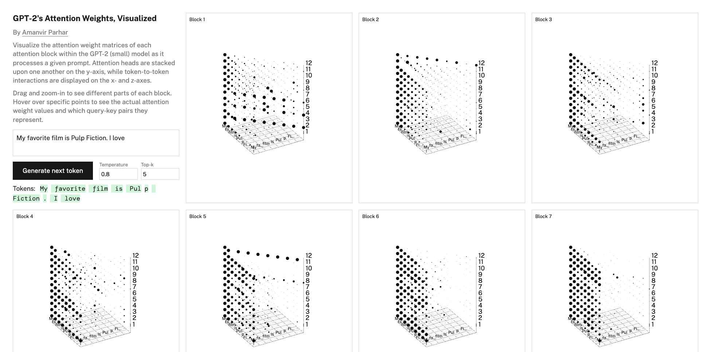

# LMPeek

[](https://amanvir.com/gpt-2-attention)

A dead-simple library that provides useful abstractions for exploring LLM internals in the browser.

Relies on [`onnxruntime-web`](https://onnxruntime.ai/docs/tutorials/web/). Currently only supports [GPT-2-small](./export/model.py).

## Motivation

> _The web is a powerful medium to share new ways of thinking. Over the last few years we’ve seen many imaginative examples of such work. But traditional academic publishing remains focused on the PDF, which prevents this sort of communication._
>
> \- [distill.pub](https://distill.pub/about)

LMPeek is my attempt at lowering the barrier to entry for ML enthusiasts interested in "looking inside" LLMs and sharing their findings with the world.

[Having done this](https://amanvir.com/gpt-2-attention) myself in the past, I feel that [current](https://huggingface.co/docs/transformers.js/en/index) [libraries](https://onnxruntime.ai/docs/tutorials/web/) don't provide the right set of abstractions for people looking to build interactive visualizations and experiences for the web.

While they're very customizable and comprehensive in certain aspects, they don't...

- Do inference on separate threads
- Cache model weights locally
- Return data for hidden states

...out of the box.

On the other hand, LMPeek...

- Automatically handles model downloading and caching
- Performs tokenization + inference on web worker
- Exposes embeddings, attention weights, MLP activations, logits, and more

## Example Usage

```typescript
import { loadModel } from "lmpeek";

// Load model (with default tokenizer)
const model = await loadModel("gpt-2", { logging: true });

// Run a forward pass to get all internal states
const outputs = await model.forward("The quick brown fox");
console.log(outputs);

// Get final logits
const logits = outputs.final.logits.data as Float32Array;

// Sample next token, optionally providing sampling parameters
const tokens = await model.sample(logits, {
  temperature: 0.8,
  topP: 0.9,
  topK: 50,
});
console.log(tokens);

// Clean up
model.dispose();
```

## License

[MIT](https://github.com/amanvirparhar/lmpeek?tab=MIT-1-ov-file)
